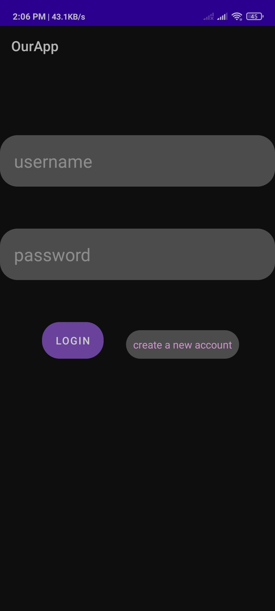
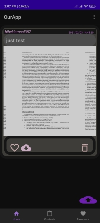
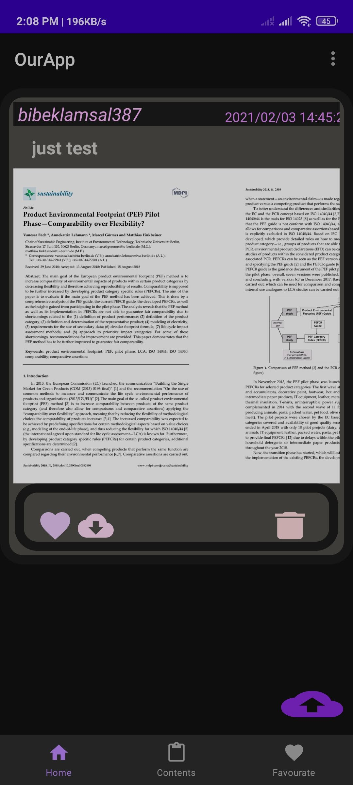

# OurApp
<h1>Student Helper Application</h1>
<h3>You can use this application for downloading ,uploading,sharing information like pdf which makes easy to learn subjects.</h3>

 Anyone can post the useful materials in any subject .

<table border="1" cellpadding="5" cellspacing="10" style="gravity:center;">
<tr><th>
#LoginPage
  </th>
  
  <th>
#SignInPage
  </th>
    <th>
#HomePage
  </th>

</tr> 
 <tr>
  <td>

For Authentication into firebase Account.

    </td>
    <td>

For creating new user into firebase.

    </td>
    <td>
    User home page  after authentication successfull.
    </td>
    </tr>
  
 <tr>
 <td>

 </td>
 <td>
 
 </td>
  <td>
 
 </td>
 
 </tr>
 
  </table>
  
  

  
  
<table border="1" cellpadding="5" cellspacing="10">
<tr><th>
#ContentPage
  </th>
  
  <th>
#FavouratePage
  </th>
    <th>
#RemovedFromFavoratePage
  </th>

</tr> 
 <tr>
  <td>

For Available Contents(PDF)

    </td>
    <td>

Favourate Contents.

    </td>
    <td>
   
 Removed from Favorate Dialog

    </td>
    </tr>
  
 <tr>
 <td>

 </td>
 <td>
 
 </td>
  <td>
 
 </td>
 
 </tr>
 
  </table>
